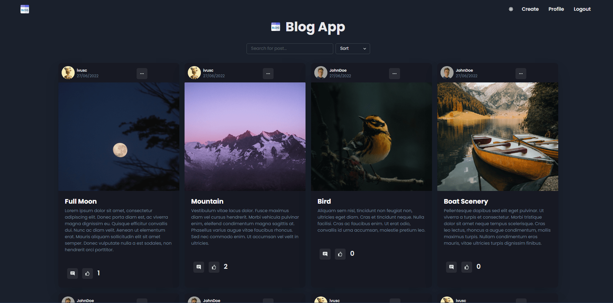

  
  # 🌐 Blog App 🌐

# Features ✨

 Users can 

- perform CRUD operations on posts
- filter and search for posts
- register / login / logout
- like posts

Click [here](https://www.ivuschua.com/projects/react/blogapp) to read more about this website.

# Tech Stack 💻

- Chakra UI
- Mongo DB
- Express
- NodeJS
- React

If you've liked this website, feel free to give it a star! 🌟

  ## Click [here](https://blogapp-crix.netlify.app/) to visit the live website demo.

